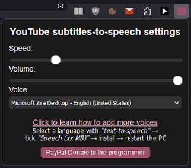
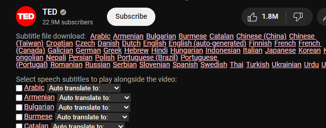

# YouTube Subtitle Reader

 

This is a Firefox extension that allows users to have YouTube subtitles read aloud.
It's a unique extension that fills a gap in the "market", as at the time of publishing, there is no other software/extensions available that provide this functionality.

[Chrome Web Store official link, more voices straight out the box, will work on Edge browser too.](https://chrome.google.com/webstore/detail/youtube-subtitle-reader/nplkdkbfnfheognggghkckpgngbjkahe)

[Firefox Browser Add-ons official link](https://addons.mozilla.org/en-US/firefox/addon/youtube-subtitle-reader/)

#### In terms of number/quality of available voices provided by the browser MS Edge > Chrome > Firefox, with the Firefox having the least number of voices.

 

## Passive Exposure Research in Language Learning

Research has shown that passive exposure to a language can be beneficial for language learning. Several studies have explored the impact of passive exposure on language acquisition. To learn more about this topic, please refer to the following studies:

- [Research demonstrated that systematic exposure to a foreign language enhances talker learning and perceptual learning, which precedes sentence comprehension.](https://www.sciencedirect.com/science/article/abs/pii/S0010027715300111)

- [Another research study focused on the impact of controlled exposure in a classroom setting and found that systematic exposure had a positive effect on the acquisition of complex structures, such as passive voice sentences.](https://www.tandfonline.com/doi/full/10.1080/15475441.2021.1875830)

- [A study conducted with intermediate Spanish students of English as a foreign language examined the potential learning effects derived from watching subtitled media. The study explored the impact of watching a TV drama with English, Spanish, or no subtitles and its effects on language learning.](https://journals.plos.org/plosone/article?id=10.1371/journal.pone.0158409)

---

1. Vocabulary Acquisition: Regular exposure to language audio can help learners acquire new vocabulary naturally. Through repeated exposure, learners can develop familiarity with word usage, pronunciation, and context, leading to improved vocabulary retention.

2. Pronunciation and Intonation: Listening to native speakers or audio recordings can enhance learners' understanding and reproduction of correct pronunciation and intonation patterns. Regular exposure to authentic language audio can help learners develop a more natural-sounding accent.

3. Comprehension Skills: Passive exposure to language audio exposes learners to different speech patterns, accents, and linguistic structures. Over time, this exposure improves listening comprehension skills, allowing learners to understand spoken language more easily.

4. Cultural Understanding: Language audio often contains cultural references, idiomatic expressions, and nuances specific to a particular culture. Passive exposure to language audio can help learners gain insights into the target language's culture, customs, and social norms.

### Could also be beneficial to blind people.

This extension, could be in theory, beneficial to blind people. I'll be inquiring in online spaces for blind people for feedback.

## Minimal Permissions and Open Source Code

I structured the extension to require minimal permissions and the source code is open for inspection. I believe in transparency. By keeping permissions to a minimum, we ensure that your browsing experience remains secure and protected.

## Resource Efficiency

The code of this extension has been developed with resource efficiency in mind. I have some formal software engineering background, which allowed me to optimize the code for performance. For example, I employed binary search algorithm to enhance an array search functionality, minimizing resource consumption. I made sure the code does no more than it's absolutely necessary.

## No Ads

I am committed to providing an ad-free experience to users. This extension is free from any kind of advertisements, allowing you to focus solely on enjoying your YouTube content with the added convenience of subtitle reading.

## Donations

If you find this extension useful and would like to support its development and future enhancements, donations are greatly appreciated. Your contributions help motivate me to continue improving the extension and adding new features. You can donate via [PayPal/Card](https://www.paypal.com/donate/?hosted_button_id=2QH26ZA928JNC)

## Google Translate Voices and Firefox Compatibility

~~I might decide to spend hours to implement it on Firefox, in future, although that's not guranteed.~~ Please note that the Firefox version of the extension includes Google Translate voices unofficially (they restrict them to Google products..., accessing them programmatically is a work around... I have spent a lot of time implementing just that subfunctionality.
**Google Translate voices work with normal API call, on Chrome browser wersion of this extension.**

---

This is due to the fact that the Chrome browser belongs to Google, and the voices work seamlessly on Chrome without any additional setup. However, accessing Google voices in Firefox extensions, such as ReadAloud, doesn't use official methods, and could be in breach of terms and conditions. Moreover, the Google voices used in ReadAloud could stop working unexpectedly. Therefore, to ensure a stable and compliant experience, the Firefox version of this extension does not include Google voices.

## Localization

This extension is localized to most major languages. The language of extensions settings changes based on default browser's language (the preferred language of the user, usually the language of the browser User Interface). I strive to make the extension accessible to users of different languages, providing a seamless experience regardless of your preferred language.

### Examples:

  

---

---

## License

This project is licensed under the [GPLv3 License](https://www.gnu.org/licenses/gpl-3.0.en.html). Feel free to modify and distribute the code according to the terms of the license.

---

If you have any questions, suggestions, or issues, please don't hesitate to [contact me](mailto:conrad.rzuc@gmail.com). Your feedback is valuable in helping improve the extension and provide a better user experience.
